# TermChatUI Architecture

> Generated from GitNexus knowledge graph (637 symbols, 1212 relationships, 33 execution flows).

## Overview

TermChatUI (TCUI) is a terminal-based chat application built in Rust. It uses `ratatui` for terminal UI rendering, `crossterm` for input handling, `rusqlite` for local persistence, and integrates with LLM providers via HTTP APIs. The architecture follows a classic event-loop pattern with an action dispatch system separating input handling from state mutations.

The codebase consists of **47 source files** organized into 7 major functional areas:

| Area | Files | Role |
|------|-------|------|
| **UI** | 20 | Terminal rendering, layout, widgets, modals, components |
| **App** | 4 | Event loop, action dispatch, state management |
| **Config** | 4 | App settings, API key storage, soul/agent configs |
| **Storage** | 2 | SQLite database (messages, conversations, settings) |
| **LLM** | 5 | Provider abstraction, HTTP client, streaming, tools |
| **MCP** | 4 | Model Context Protocol client, registry, transport |
| **Obsidian** | 5 | Vault file integration, diff safety, file watcher |

---

## Functional Areas

### 1. App (`src/app/`)

The core application loop lives in `TuiApp` (`src/app.rs`). It owns the event loop (`run`), processes keyboard/mouse input (`handle_key`, `handle_mouse`), and dispatches actions (`dispatch`).

Key types:
- `TuiApp` — Main app struct holding storage, config, UI state, LLM client, vault
- `Action` — Enum of all possible user/system actions (Quit, SendMessage, ToggleSettings, etc.)
- `Message` — Chat message model (role, content, thinking, tool calls, images)
- `Tab` — Chat tab configuration (provider, model, endpoint, soul, agent)

The event loop (`run`) uses `tokio::select!` to concurrently handle:
- Terminal tick (33ms redraw)
- Crossterm key/mouse/resize events
- Async actions from the action channel

### 2. UI (`src/ui/`)

All rendering is pure and stateless per frame. The `UI` struct (`src/ui/mod.rs`) holds mutable tab state and orchestrates the layout:

```
┌─ Top Bar (tabs, hamburger, close) ─┐
├─ Sidebar ─┼─ Chat Area ───────────┤
│           │  Messages             │
│           │  Input                │
├─ Status Bar (connection, MCPs) ──┘
```

**Widgets:**
- `top_bar.rs` — Tab bar with clickable tabs, hamburger menu, close button
- `sidebar.rs` — Conversation list, New Chat button, Settings button
- `chat_tab.rs` — Message list, input box, provider/model selector
- `status_bar.rs` — Connection status, MCP server indicators
- `settings_tab.rs` — Settings popup (General, Keybindings, API Keys tabs)
- `session_list.rs` — Session/conversation switcher
- `obsidian_tab.rs` — Obsidian vault file tree and preview

**Modals:**
- `quit_confirm.rs` — Exit confirmation
- `new_tab.rs` — Create new chat tab
- `mcp_config.rs` — MCP server configuration
- `help.rs` — Keyboard shortcuts help
- `confirm_diff.rs` — Code diff review modal

**Components:**
- `chat_message.rs` — Individual message bubble rendering
- `markdown.rs` — Markdown rendering with syntax highlighting
- `diff_view.rs` — Side-by-side diff display
- `image_block.rs` — Image display in chat
- `collapsible.rs` — Collapsible sections (e.g., thinking blocks)

### 3. Storage (`src/storage/`)

SQLite persistence via `rusqlite` (bundled). The `Storage` struct manages:

- `messages` — Chat messages with metadata (thinking, tool calls, images, diffs)
- `conversations` — Conversation groups per tab
- `tabs` — Tab configuration (provider, model, endpoint, API key refs)
- `settings` — Key-value app settings (use_env_keys, api_key_*, custom_endpoint, etc.)
- `mcp_servers` — MCP server configurations
- `file_backups` — Backup entries for file modifications
- `key_metadata` — Encryption salt for key storage

Database path: `~/.local/share/tcui/tcui.db` (Linux) or platform equivalent.

### 4. Config (`src/config/`)

- `app_config.rs` — `AppConfig` (TOML serialized), default provider/model, vault path, tab configs. Stored at `~/.config/tcui/config.toml`.
- `key_store.rs` — `KeyStore` with `KeyEntry` variants: Keyring, Encrypted, Env
- `soul.rs` — Soul/agent personality configuration loading

### 5. LLM (`src/llm/`)

- `client.rs` — `LlmClient` with async `set_api_key`, holds `ClientConfig` (provider, model, API keys HashMap)
- `provider.rs` — `Provider` enum (OpenAI, Anthropic, Gemini, Ollama, Custom) with endpoint URLs
- `stream.rs` — Streaming response handling
- `tools.rs` — LLM tool/function call definitions

Supported endpoints:
| Provider | Endpoint |
|----------|----------|
| OpenAI | `https://api.openai.com/v1` |
| Anthropic | `https://api.anthropic.com/v1` |
| Gemini | `https://generativelanguage.googleapis.com/v1` |
| Ollama | `http://localhost:11434/v1` |

### 6. MCP (`src/mcp/`)

Model Context Protocol integration for external tool servers:
- `client.rs` — MCP client connection management
- `registry.rs` — Server registration and lookup
- `transport.rs` — stdio and HTTP transports

### 7. Obsidian (`src/obsidian/`)

File-based knowledge vault integration:
- `vault.rs` — File listing, reading, searching, writing
- `safety.rs` — Diff generation, backup creation, diff review parsing
- `watcher.rs` — File system change monitoring (`notify` crate)

---

## Key Execution Flows

### 1. Main → Event Loop → Render

```
main (src/main.rs)
  → setup_terminal (crossterm raw mode, alternate screen)
  → TuiApp::new(storage, config, llm, vault)
  → TuiApp::run
      → terminal.draw(|f| UI::render(f))
      → tokio::select!
          ├─ tick.tick()        → redraw
          ├─ crossterm events   → handle_key / handle_mouse
          └─ action_rx          → dispatch(action)
```

This is the primary cross-community flow spanning **App → UI**.

### 2. Settings Load/Save → Database

```
dispatch (src/app.rs)
  → load_settings_popup_state
      → storage.get_all_settings
          → Storage::new → db_path
              → ~/.local/share/tcui/tcui.db
```

This is the longest traced process (5 steps). Settings are read from the `settings` table on popup open and written back on close.

### 3. Chat Render Pipeline

```
run (src/app.rs)
  → UI::render (src/ui/mod.rs)
      → TopBar::render (src/ui/top_bar.rs)
          → render_tabs
      → Sidebar::render (src/ui/sidebar.rs)
      → ChatTab::render (src/ui/chat_tab.rs)
          → render_title
          → render_provider_model
          → render_messages
          → render_centered_input
      → StatusBar::render (src/ui/status_bar.rs)
```

Each frame rebuilds the layout tree and renders all visible widgets.

### 4. Send Message → Storage

```
handle_key → Enter
  → Action::SendMessage(content)
      → dispatch
          → storage.save_message(&msg)
          → UI::add_message
          → (first message?) generate_title
              → UI::add_chat_to_active_tab(title)
```

### 5. Settings API Keys → Environment Scan

```
handle_key → Space on "Grab keys from env" toggle
  → settings.use_env_keys = true
  → SettingsPopup::grab_keys_from_env
      → std::env::var(OPENAI_API_KEY, ANTHROPIC_API_KEY, ...)
      → read .env and ~/.env
      → storage.set_setting("api_key_<provider>", key)
```

When the toggle is activated, the app scans environment variables and `.env` files, autofilling the saved keys list and persisting to SQLite.

---

## Mermaid Architecture Diagram

```mermaid
flowchart TB
    subgraph Entry["Entry Point"]
        M["main.rs\nsetup_terminal\nrestore_terminal"]
    end

    subgraph AppLayer["App Layer"]
        A["TuiApp (app.rs)"]
        Act["Action Enum (action.rs)"]
        Msg["Message (message.rs)"]
        Tab["Tab (tab.rs)"]
    end

    subgraph UI["UI Layer (ratatui)"]
        U["UI (mod.rs)"]
        TB["TopBar"]
        SB["Sidebar"]
        CT["ChatTab"]
        ST["StatusBar"]
        SET["SettingsPopup"]
        MOD["Modals"]
        COMP["Components\nmarkdown, diff, image"]
    end

    subgraph Storage["Storage Layer"]
        DB["Storage (db.rs)\nSQLite: messages, conversations,\nsettings, tabs, mcp_servers"]
    end

    subgraph Config["Config Layer"]
        AC["AppConfig (TOML)"]
        KS["KeyStore"]
        SOUL["Soul Config"]
    end

    subgraph LLM["LLM Layer"]
        LC["LlmClient"]
        PRV["Provider Enum"]
        STR["Stream"]
        TOOL["Tools"]
    end

    subgraph MCP["MCP Layer"]
        MC["McpClient"]
        REG["Registry"]
        TRN["Transport"]
    end

    subgraph Obsidian["Obsidian Layer"]
        VAULT["Vault"]
        SAFE["Safety (diff/backup)"]
        WATCH["File Watcher"]
    end

    M --> A
    A -->|dispatch| Act
    A -->|render frame| U
    A -->|read/write| DB
    A -->|load/save| AC
    A -->|set keys| KS
    A -->|chat| LC
    A -->|tools| MC
    A -->|vault| VAULT

    U --> TB
    U --> SB
    U --> CT
    U --> ST
    U --> SET
    U --> MOD
    CT --> COMP

    LC --> PRV
    LC --> STR
    LC --> TOOL

    MC --> REG
    MC --> TRN

    VAULT --> SAFE
    VAULT --> WATCH

    style Entry fill:#f9f,stroke:#333
    style AppLayer fill:#bbf,stroke:#333
    style UI fill:#bfb,stroke:#333
    style Storage fill:#fbb,stroke:#333
    style Config fill:#ffb,stroke:#333
    style LLM fill:#bff,stroke:#333
    style MCP fill:#fbf,stroke:#333
    style Obsidian fill:#eee,stroke:#333
```



---

## Data Flow Summary

| Flow | Direction | Persistence |
|------|-----------|-------------|
| User input → Action → UI update | In-memory | None |
| Chat messages | App → Storage | SQLite (`messages` table) |
| Conversations | App → Storage | SQLite (`conversations` table) |
| API keys / settings | App ↔ Storage | SQLite (`settings` table) |
| App config (provider, model, theme) | Disk → App | TOML (`~/.config/tcui/config.toml`) |
| LLM streaming | LLM → UI | None (real-time) |
| Obsidian file ops | Vault → UI | Disk (vault path) |

---

## Key Design Decisions

1. **Action dispatch pattern** — All user input is converted to `Action` enums and dispatched through a single `dispatch` method. This centralizes side effects and makes the UI layer purely presentational.

2. **Frame-based rendering** — The entire UI is redrawn every 33ms (30 FPS) via `terminal.draw`. No widget retains internal rendering state; all layout is computed from `UI` and `ChatTabState`.

3. **SQLite for runtime state, TOML for static config** — Transient chat data (messages, conversations, keys) lives in SQLite. Static user preferences (theme, default provider) live in TOML.

4. **Provider abstraction** — The `Provider` enum maps display names to base URLs. Custom providers are supported via free-form endpoint + key inputs.

5. **Event loop concurrency** — `tokio::select!` combines crossterm events, timed ticks, and async action channels without blocking the UI thread.
